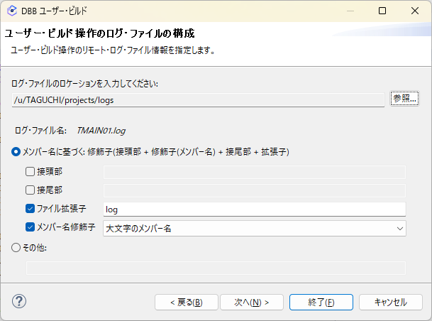

# ISEConf2023_MySampleDBB01 概要

DBB - zAppBuildの仕組みを使って、COBOLソースのビルドのデモを行うためのサンプルです。
VS Code/IDzからUser Buildを行う、また、Jenkins PiplineからFull Buildを行うシナリオを想定しています。

シンプルなCOBOLのソースが3つ含まれます。

COBOLソース
- TMAIN01.cbl: メインプログラム (以下のサブプログラムを動的CALL)
- TSUB02.cbl: サブプログラム
- TSUB03.cbl: サブプログラム

COPYBOOK
- CPPARM01.cpy: TMAIN01の引数を表す構造体
- CPPARM02.cpy: TSUB02の引数を表す構造体
- CPPARM03.cpy: TSUB03の引数を表す構造体

その他
- zpp.yaml: DBB関連のパラメーター設定を含む構成ファイル
- .gitattributes: 文字コード関連の設定を含む構成ファイル
- application-conf以下: zAppBuild用のアプリ側構成ファイル

参考: [zopeneditor-sample](https://github.com/IBM/zopeneditor-sample/tree/wazi-main)

# 前提

z/OS側にDBB, zAppBuildは設定済みの想定とします。

## DBB 

環境変数設定例
- DBB_HOME=/usr/lpp/IBM/dbb
- DBB_CONF=/etc/dbb

## zAppBuild

/u/ibmuser/dbb-zappbuild/ 以下に整備している想定

## USS作業用ディレクトリ

User Buildを行う各ユーザーごとのDBB作業用ディレクトリを作成しておきます。ここでは以下のディレクトリを作成する想定です。
- /u/user01/projects/
- /u/user01/projects/logs

# User Build / VS Code編

## VS Code設定

VS Code, Zowe Explorer, IBM Z Open Editor の構成を行い、開発環境のz/OSとの接続情報をProfileとして登録しておきます。
z/OSMF および SSH のProfileが必要になります。

<details><summary><font color="lightblue">設定例</font></summary><div>
zowe.config.user.json

```json
{
    "$schema": "./zowe.schema.json",
    "profiles": {
        "eplex1": {
            "properties": {
                "host": "eplex1"
            },
            "profiles": {
                "zosmf": {
                    "type": "zosmf",
                    "properties": {
                        "port": 10443,
                        "encoding": "IBM-1399"
                    }
                },
                "tso": {
                    "type": "tso",
                    "properties": {
                        "account": "ACCT#",
                        "codePage": "1047",
                        "logonProcedure": "IZUFPROC"
                    }
                },
                "ssh": {
                    "type": "ssh",
                    "properties": {
                        "port": 22
                    }
                }
            },
            "secure": [
                "user",
                "password"
            ]
        },
        "isecloud_zdt01": {
            "properties": {
                "host": "zdt01"
            },
            "profiles": {
                "zosmf": {
                    "type": "zosmf",
                    "properties": {
                        "port": 10443
                    }
                }
            },
            "secure": [
                "user",
                "password"
            ]
        },
        "isecloud_wazi01": {
            "properties": {
                "host": "wazi01"
            },
            "profiles": {
                "zosmf": {
                    "type": "zosmf",
                    "properties": {
                        "port": 10443
                    }
                },
                "ssh": {
                    "type": "ssh",
                    "properties": {
                        "port": 22,
                        "privateKey": "C:\\Users\\xxx\\.ssh\\xxx\\id_rsa_wazi"
                    }
                }
            },
            "secure": [
                "user",
                "password"
            ]
        },
        "base": {
            "type": "base",
            "properties": {
                "rejectUnauthorized": false
            }
        }
    },
    "defaults": {
        "zosmf": "eplex1.zosmf",
        "tso": "eplex1.tso",
        "ssh": "eplex1.ssh",
        "base": "base"
    },
    "autoStore": true
}
```

</div></details>


参考: [Configuring team profiles - Team configuration for team leaders](https://docs.zowe.org/stable/user-guide/cli-using-team-configuration-team-leaders)


## デモ・シナリオ

### (1) リポジトリのクローン

VS Code上の適当なワークスペースにクローンを作成します。

### (2) DBB関連設定 (環境情報)

VS Codeの設定で、DBB関連の環境周りの設定を行います。

設定例: 

```json
	"settings": {
		"zopeneditor.userbuild.userSettings": {
			"dbbWorkspace": "/u/user01/projects",
			"dbbHlq": "USER01.DBB",
			"dbbLogDir": "/u/user01/projects/logs",
			"dbbDefaultZappProfile": "dbb-userbuild"
		},
		"zopeneditor.zowe": {
			"defaultCliProfile": "isecloud_wazi01.zosmf",
			"defaultSshCliProfile": "isecloud_wazi01.ssh"
		},
        ...
```

補足:
- dbbWorkspace: USS上の作業用ディレクトリ
- dbbHlq: ソースやロードモジュールを配置するPDSデータセットのHLQ (存在していなければ自動で作成される)
- dbbLogDir: ログ出力用のｄUSS上でディレクトリ
- dbbDefaultZappProfile: 後述のZAPPファイルで指定するDBB実行用のプロファイル名を指定します
- defaultCliProfile: DBBのUser Buildで接続する先のz/OSのプロファイル(z/OSMFプロファイル)
- defaultSshCliProfile: DBBのUser Buildで接続する先のz/OSのプロファイル(SSHプロファイル)

### (3) DBB関連設定 (ビルド関連情報)

クローンしたリポジトリに含まれるzapp.yamlを環境に合わせてカスタマイズします。

設定例: 

```yaml
################################################################
# LICENSED MATERIALS - PROPERTY OF IBM
# "RESTRICTED MATERIALS OF IBM"
# (C) COPYRIGHT IBM CORPORATION 2020, 2022. ALL RIGHTS RESERVED
# US GOVERNMENT USERS RESTRICTED RIGHTS - USE, DUPLICATION,
# OR DISCLOSURE RESTRICTED BY GSA ADP SCHEDULE
# CONTRACT WITH IBM CORPORATION
################################################################

name: VSCode01
description: For IBM Z Open Editor 3.0.0 or newer. Wazi's code samples with COBOL, PL/I, and HLASM applications
version: 3.0.0
author:
  name: IBM CORPORATION

propertyGroups:
  - name: cobol-copybooks
    language: cobol
    libraries:
      - name: syslib
        type: local
        locations:
          - "**/copybook"

profiles:
  - name: dbb-userbuild
    type: dbb
    settings:
      application: VSCode01
      command: "$DBB_HOME/bin/groovyz -DBB_PERSONAL_DAEMON"
      buildScriptPath: "/u/ibmuser/dbb-zappbuild/build.groovy"
      buildScriptArgs:
        - "--userBuild"
        - "--workspace ${zopeneditor.userbuild.userSettings.dbbWorkspace}"
        - "--application ${application}"
        - "--hlq ${zopeneditor.userbuild.userSettings.dbbHlq}"
        - "--outDir ${zopeneditor.userbuild.userSettings.dbbLogDir}"
      additionalDependencies:
        - application-conf
        - "zapp*"
      logFilePatterns:
        - "${buildFile.basename}.log"
        - "BuildReport.*"

```

補足:
- profiles.name: 上の設定の"dbbDefaultZappProfile"に合わせる
- profiles.setting.buildScriptPath: USS上に構成したdbb-zappbuildのパス
- profiles.setting.buildScriptArgs: DBB Buildコマンドのオプション

参考:
- [IBM Z® Open Editor makes building COBOL, PL/I, and HLASM applications easier with User Build](https://ibm.github.io/zopeneditor-about/Blog/userbuild-blog.html#architectural-overview)
- [IBM Z and Cloud Modernization Stack - Setting up the user build](https://www.ibm.com/docs/en/cloud-paks/z-modernization-stack/2022.4?topic=code-setting-up-user-build)


### (4) COBOLソース編集

編集したいCOBOLのソースを開いて適宜編集。

### (5) ビルド実行

ビルドしたいCOBOLのソースを開いて、エディターを右クリック - "Run setup for IBM User Build"を選択。
その後、エディターを右クリック - "Run IBM User Build"を選択。


# User Build / IDz編

## IDz設定

IDz上で開発環境のz/OSとの接続構成を行っておきます(RSE経由での接続)。


## デモ・シナリオ

### (1) リポジトリのクローン

IDz上にクローンを作成します。

### (2) z/OSプロジェクトの設定

クローン後、作業ツリーを右クリック - z/OSプロジェクトの作成を選択


z/OSプロジェクトビューで、追加されたプロジェクトを右クリック - 依存関係ベースのビルド - ローカル属性グループの生成を選択


ローカルCOBOL設定を選択して終了


プロジェクトと同じ名前のプロパティー・グループが作成されるので、必要に応じてカスタマイズする。


### (3) COBOLソース編集

編集したいCOBOLのソースを開いて適宜編集。

### (4) ビルド実行

ビルドしたいソースを開いているエディターを右クリック - 依存関係ベースのビルド - ユーザービルドの構成を選択


DBB関連の情報を設定します。(適宜環境に応じて読み替えてください)


.gitattributesファイルを指定して次へ


ログの設定を適宜変更して次へ



オプションとして`--application`を追加します。値はプロジェクト名と同一名を指定します。


当該ソースと一緒に転送するファイルを選択します(application-conf以下も選択します)。


最終確認して終了 ⇒ ビルドが開始される


ビルドが完了するとポップアップが出てログの詳細(コンパイル結果)が確認できます。


コンソール・ビューからビルド時のログも確認できます。


# Full Build

## 前提

### z/OS側

DBB, zAppBuildは設定済みの想定とします。

Jenkins Agent用のユーザーを作成し、このユーザーでGit Clientが利用できるように、ホームディレクトリにUTF-8で`.gitconfig`ファイルを作成しておきます。

例：
```
[user]
        name = JENKIN1
        email = JENKIN1@example.com
[http]
        sslverify = false
[credential]
        helper = cache --timeout=3600
```


### Jenkins / Node設定


主なパラメーター補足:
| 項目                         | 設定例                                                                                                                                                                                                                                                                                                                |
| -------------------------- | ------------------------------------------------------------------------------------------------------------------------------------------------------------------------------------------------------------------------------------------------------------------------------------------------------------------ |
| リモートFSルート                  | /u/JENKIN1/agent/work                                                                                                                                                                                                                                                                                              |
| 起動方法                       | SSH経由でUnixマシンのスレーブエージェントを起動                                                                                                                                                                                                                                                                                        |
| 認証情報                       | USS上のJenkins用ユーザーでのSSH接続に必要な認証情報をJenkins上に管理しておく                                                                                                                                                                                                                                                                   |
| Javaのパス                    | /usr/lpp/java/java11/J11.0_64/bin/java                                                                                                                                                                                                                                                                             |
| JVMオプション                   | -Xquickstart -Dfile.encoding=UTF-8 -Xnoargsconversion -Dorg.jenkinsci.plugins.gitclient.CliGitAPIImpl.user.name.file.encoding=IBM-1047 -Dorg.jenkinsci.plugins.gitclient.CliGitAPIImpl.user.password.file.encoding=IBM-1047 -Dorg.jenkinsci.plugins.gitclient.CliGitAPIImpl.user.passphrase.file.encoding=IBM-1047 |
| Prefix Start Agent Command | . /etc/dbb/gitenv.sh && export GIT_CONFIG_NOSYSTEM=0 && export JAVA_HOME=/usr/lpp/java/java11/J11.0_64 && export IBM_JAVA_ENABLE_ASCII_FILETAG=ON && env &&                                                                                                                                                        |
| Suffix Start Agent Command | -text (先頭にブランクを入れる)                                                                                                                                                                                                                                                                                                |


環境変数補足:

| 環境変数                 | 設定例                      | 補足  |
| -------------------- | ------------------------ | --- |
| DBB_HOME             | /usr/lpp/IBM/dbb         |  DBBがインストールされているディレクトリ   |
| ZAPPBUILD_HOME       | /u/ibmuser/dbb-zappbuild |   zAppBuildをセットアップしたディレクトリ  |
| DBB_BUILD_EXTRA_OPTS |    -DBB_DAEMON_HOST 127.0.0.1 -DBB_DAEMON_PORT 7380                      |    zAppBuild実行時の追加オプション |


### Jenkinsfile

当リポジトリ上のJenkinsfileを必要に応じてカスタマイズ


### Jenkins / Pieline設定


主なパラメーター補足:
| 項目             | 設定例                                                     |
| -------------- | ------------------------------------------------------- |
| Gitプロジェクトリポジトリ | 当リポジトリのURIを指定 |
| 認証情報           | GitHubへのアクセスに必要な認証情報をJenkins上に管理しておく                    |
| Mode           | by Jenkinsfile                                          |
| Script Path    | Jenkinsfile                                                        |


## デモ・シナリオ

Jenkinsの管理コンソールからPipelineを手動実行

